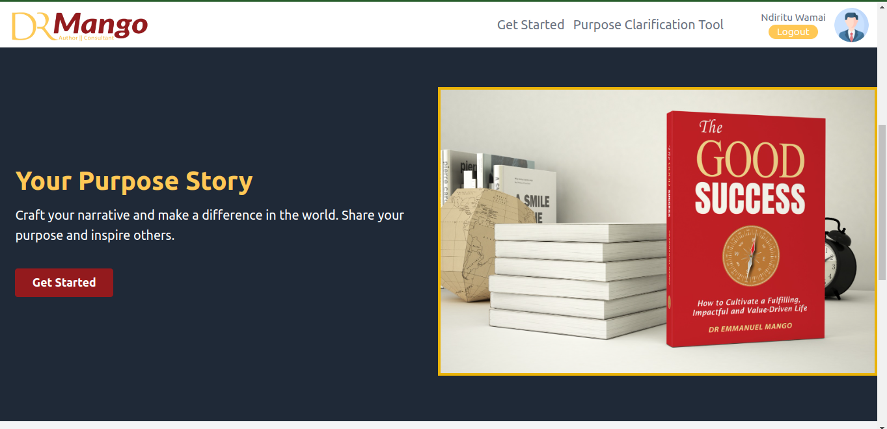

# Purpose Story App



### Frontend Application

Navigate to the frontend directory

```
cd frontend/
```

#### Configurations

Create a `.env` file inside the `frontend` directory and add the following environment variables;

- `REACT_APP_SERVICE_ID`
- `REACT_APP_TEMPLATE_ID`
- `REACT_APP_PUBLIC_KEY`
- `REACT_APP_API_URL`: This is the URL to your backend app in the form `https://yourdomain.com` PLease don't include a slash at the end like in `https://yourdomain.com/` This would bring an error while sending reuests. This application uses the same backend app as with [Purpose Clarity Tool](https://github.com/wamae-ndiritu/purpose-clarity-tool)

> Please get in touch with me via my contacts to get the values of the above env variables.

#### Installing dependencies

Run the following command inside the `frontend` directory to install all the necessary dependencies;

```
npm install
```

#### Starting the development server

To start the development server run;

```
npm start
```

#### Packaging for production

To deploy the frontend application (`frontend`) you need to create a production build. Navigate inside the v2 directory of your frontend application and run the following command;

```
npm run build
```

#### Deploying the frontend application

All the files to be deployed will be inside the `build` directory that will be generate after packaging for production.
